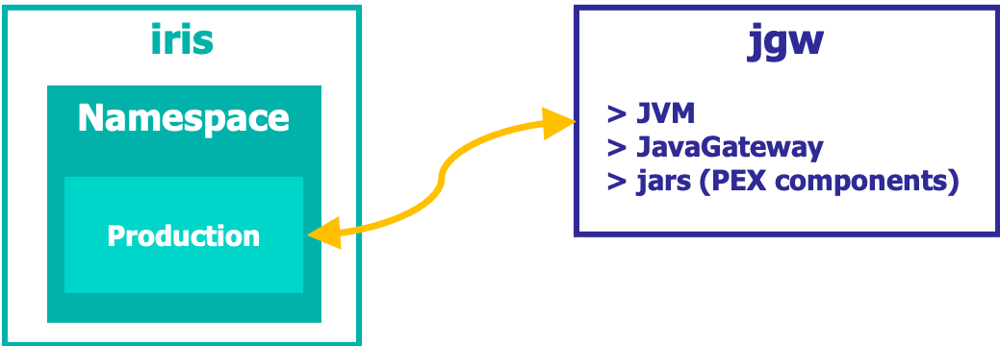

# Workshop: PEX
This repository contains the materials and some examples you can use to learn the basic concepts of PEX (Production EXtension) in IRIS Interoperability. 

You can find more in-depth information in https://learning.intersystems.com.

New to IRIS Interoperability framework? Have a look at [IRIS Interoperability Intro Workshop](https://github.com/intersystems-ib/workshop-interop-intro).

# What do you need to install? 
* [Git](https://git-scm.com/downloads) 
* [Docker](https://www.docker.com/products/docker-desktop) (if you are using Windows, make sure you set your Docker installation to use "Linux containers").
* [Docker Compose](https://docs.docker.com/compose/install/)
* [Visual Studio Code](https://code.visualstudio.com/download) + [InterSystems ObjectScript VSCode Extension](https://marketplace.visualstudio.com/items?itemName=daimor.vscode-objectscript)

# Setup
Build the image and run the container we will use during the workshop:

```console
$ git clone https://github.com/intersystems-ib/workshop-pex
$ cd workshop-pex
$ docker-compose build
```

Then copy some libraries you will need from the *iris* container:

In a VS Code Terminal type:
```console
docker cp iris:/usr/irissys/dev/java/lib/JDK18/intersystems-gateway-3.1.0.jar java/lib
docker cp iris:/usr/irissys/dev/java/lib/JDK18/intersystems-jdbc-3.1.0.jar java/lib
docker cp iris:/usr/irissys/dev/java/lib/JDK18/intersystems-utils-3.1.0.jar java/lib
docker cp iris:/usr/irissys/dev/java/lib/gson/gson-2.8.5.jar java/lib
```

# Examples

## (a). FirstDemo interoperability Production
* Run the containers we will use in the workshop:
```
docker-compose up -d
```
* Open the [Management Portal](http://localhost:52773/csp/sys/UtilHome.csp).
* Login using the default `superuser`/ `SYS` account.
* Click on [Workshop.PEX.FirstDemo.Production](http://localhost:52773/csp/user/EnsPortal.ProductionConfig.zen?PRODUCTION=Workshop.PEX.FirstDemo.Production&$NAMESPACE=USER) to access the sample interoperability production we will use. You can access also through *Interoperability > User > Configure > Production*.

## (b). Test MessageRouter + FirstOperation
* Click on `FirstOperation` Business Operation.
* Examine the *Settings* tab, pay attention to: `Class Name` and `Remote Business Operation` section. What is the Java Gateway server that is being used?
* Click on `MessageRouter` Business Process.
* In the *Actions* tab, click on *Test*. In the *Request Type* choose `Ens.StringRequest` and enter some text in the *StringValue field*. Send the test message.
* Inspect the resulting *Visual Trace*. 
* Notice the message that receives each component and their contents.
* `Message Router` transforms a `Ens.StringRequest` to a `EnsLib.PEX.Message`. You can see the data transform here [Workshop.PEX.FirstDemo.DT.StringRequest2PEX](http://localhost:52773/csp/user/EnsPortal.DTLEditor.zen?DT=Workshop.PEX.FirstDemo.DT.StringRequest2PEX.DTL).
* `FirstOperation` is a very simple Business Operation that is implemented on Java. We will go through it in the next section.

## (c). Understanding FirstOperation and Java Gateway
* In VS Code, open [java/src/workshop/pex/FirstOperation.java](java/src/workshop/pex/FirstOperation.java). This is the actual `FirstOperation` implementation.
* Have a look at the methods and properties. Can you find where is handling the incoming `FirstMessage` request?
* Go through [java/Dockerfile](java/Dockerfile). This Dockerfile is responsible for:
  1) Compiling Java source code & building JAR files.
  2) Creating a Java Gateway Server containing our JAR files.
* Notice that Java Gateway Server will run on a separate container (this is based on https://github.com/intersystems-community/JavaGatewayImage project).
* Inspect [docker-compose.yml](docker-compose.yml) and notice the two containers we are using. What is the hostname for the Java Gateway Server we are using?



## (d). Adding a Business Service and Business Process
* In VS Code, open [java/src/workshop/pex/FirstService.java](java/src/workshop/pex/FirstService.java) and [java/src/workshop/pex/FirstProcess.java](java/src/workshop/pex/FirstProcess.java).
* Have a look at the methods and properties. What are doing those components?
* Can you find them in the running interoperability production?
* Try to understand what are doing `FirstService` and `FirstProcess`. Go through their implementation and *Settings* tab in the production, and finally enable them and check what happens.

# Explore more complex scenarios
Have a look at those great examples on using PEX with InterSystems IRIS:
* https://github.com/intersystems-community/pex-demo
* https://github.com/intersystems-community/irisdemo-demo-kafka


